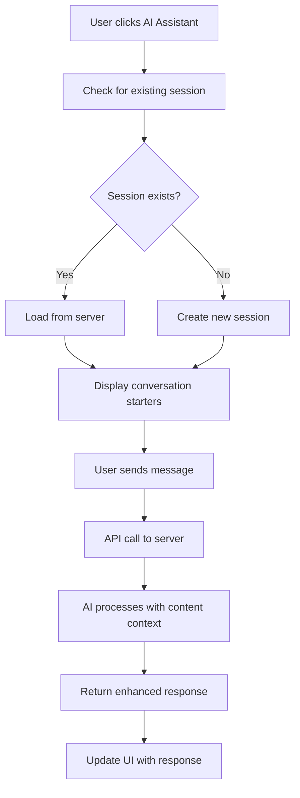

# AI Chat Server Integration - Implementation Guide

## Overview

We've successfully connected your AI chat feature to your server backend, replacing the dummy responses with real AI-powered conversations. This implementation uses your enhanced chat endpoints and provides a production-ready AI assistant experience.

## 🚀 What We've Implemented

### 1. **Enhanced API Service Layer** (`src/lib/api.ts`)

Added a new `aiChatAPI` object with methods that directly connect to your server endpoints:

```typescript
export const aiChatAPI = {
  // Start enhanced chat session with content ownership validation
  startSession: (title, contentId, description?, templateId?) =>
    POST /api/chat/start

  // Send message with enhanced validation and responses
  sendMessage: (sessionId, message) =>
    POST /api/chat/message

  // Get all chat sessions with optional content filtering
  getSessions: (filters?) =>
    GET /api/chat/sessions

  // Get enhanced session with conversation starters
  getSession: (sessionId) =>
    GET /api/chat/enhanced/sessions/:id

  // Delete a chat session
  deleteSession: (sessionId) =>
    DELETE /api/chat/sessions/:id

  // Get available chat templates
  getTemplates: (filters?) =>
    GET /api/chat/content-templates
}
```

### 2. **Enhanced Type Definitions** (`src/types/ai.ts`)

Updated types to match your server response structure:

- `AIChatMessage` - Enhanced with metadata for tokens, model info, inappropriate content detection
- `ChatSession` - Complete session structure with server sync
- `StartSessionResponse` - Response from session creation with conversation starters
- `SendMessageResponse` - Enhanced message response with insights and warnings
- `ConversationStarter` - Server-provided conversation prompts
- `ChatUIAction` - Action buttons for optimize, ideas, strategy, analyze

### 3. **Completely Rewritten AI Chat Context** (`src/context/AIChatContext.tsx`)

#### Key Features:

- **Real Server Integration**: All operations now use actual API calls
- **Session Management**: Automatically creates and manages chat sessions per content
- **Error Handling**: Comprehensive error states and user feedback
- **Conversation Persistence**: Syncs with server and maintains local cache
- **Enhanced Features**: Supports conversation starters and quick actions

#### How It Works:

**Opening a Chat:**

1. Checks if existing session exists for the content
2. If exists, loads session from server using `GET /api/chat/enhanced/sessions/:id`
3. If not, creates new session using `POST /api/chat/start`
4. Stores conversation starters and UI actions from server response

**Sending Messages:**

1. Adds user message to UI immediately for responsiveness
2. Sends message to server using `POST /api/chat/message`
3. Receives AI response with metadata (tokens, model, inappropriate content flags)
4. Updates conversation with server response
5. Handles error states and content warnings

**Data Flow:**

```
User Input → Context → API Service → Server → Response Processing → UI Update
```

### 4. **Enhanced AI Chat Modal** (`src/components/ai/ai-chat-modal.tsx`)

#### New Features:

- **Error Display**: Red banner for API errors and warnings
- **Conversation Starters**: Clickable prompts from server
- **Quick Actions**: Action buttons (Optimize, Ideas, Strategy, Analyze)
- **Content Flagging**: Visual indicators for inappropriate content
- **Enhanced Metadata**: Shows AI model used and token information
- **Better Loading States**: Improved user feedback during API calls

#### UI Enhancements:

- Server connection indicator ("Enhanced" instead of "Persistent")
- Conversation starter buttons that auto-populate input
- Quick action buttons that send predefined prompts
- Error states with clear messaging
- Inappropriate content warnings

## 🔄 How The Integration Works

### 1. **Session Lifecycle**



### 2. **Enhanced Features from Your Server**

#### Content Ownership Validation

- Server validates user owns the content before allowing chat
- Enhanced security and proper access control

#### Inappropriate Content Detection

- Server scans messages for inappropriate content
- Returns warnings and flags content when detected
- UI shows visual indicators for flagged content

#### Content Insights

- Server provides content-specific insights and suggestions
- Contextual recommendations based on content type and platform

#### Conversation Starters

- Server generates relevant conversation prompts based on content
- Dynamic suggestions that match content context

### 3. **Error Handling & User Experience**

#### Graceful Degradation

- Shows error messages without breaking the UI
- Removes user messages on send failure
- Maintains conversation state during errors

#### Loading States

- Immediate UI feedback when sending messages
- Animated loading indicators
- Prevents duplicate submissions

#### Content Warnings

- Visual indicators for flagged content
- Clear messaging about inappropriate content detection
- Non-blocking warnings that allow conversation to continue

## 🎯 Key Benefits

### For Users:

- **Real AI Responses**: Powered by your server's AI models (GPT-4o-mini, GPT-4, etc.)
- **Content-Aware**: AI understands the specific content being discussed
- **Persistent Conversations**: Chat history saved and synced with server
- **Smart Suggestions**: Relevant conversation starters and quick actions
- **Enhanced Safety**: Inappropriate content detection and warnings

### For Developers:

- **Production Ready**: Full error handling and edge case management
- **Scalable**: Uses your existing server infrastructure
- **Maintainable**: Clean separation of concerns and typed interfaces
- **Extensible**: Easy to add new features using existing patterns

## 🔧 Configuration & Customization

### Environment Variables

Make sure these are set in your `.env.local`:

```bash
NEXT_PUBLIC_API_URL=http://localhost:4000  # Your server URL
NEXT_PUBLIC_API_KEY=your-api-key           # Your API key
```

### Customizing Actions

The quick action buttons are configured by your server response. You can customize them by modifying the server's UI actions response:

```typescript
ui: {
  actions: [
    {
      type: 'optimize',
      label: 'Optimize',
      description: 'Get platform-specific optimization suggestions',
      icon: '⚡',
    },
    // Add more actions as needed
  ],
}
```

### Adding New Features

To add new features:

1. Update the API endpoints in `src/lib/api.ts`
2. Add corresponding types in `src/types/ai.ts`
3. Update the context in `src/context/AIChatContext.tsx`
4. Enhance the UI in `src/components/ai/ai-chat-modal.tsx`

## 🧪 Testing the Implementation

### Manual Testing Checklist:

1. **Open AI Chat**: Click AI Assistant card for any content
2. **Session Creation**: Verify new session is created on server
3. **Send Messages**: Test message sending and AI responses
4. **Conversation Starters**: Click suggested prompts
5. **Quick Actions**: Test action buttons (Optimize, Ideas, etc.)
6. **Error Handling**: Test with network issues or invalid requests
7. **Content Flagging**: Test inappropriate content detection
8. **Session Persistence**: Close and reopen chat to verify persistence

### Debug Information:

- Check browser console for API response logging
- Server responses include conversation starters and insights
- Error messages are logged for troubleshooting

## 🚀 Next Steps

### Potential Enhancements:

1. **Template Support**: Integrate chat templates from your server
2. **Analytics**: Add chat analytics and performance tracking
3. **Export Features**: Allow users to export conversations
4. **Advanced Actions**: Add more sophisticated AI actions
5. **Multi-language**: Support for multiple languages
6. **Voice Integration**: Add voice input/output capabilities

### Performance Optimizations:

1. **Message Streaming**: Implement real-time streaming for long responses
2. **Caching**: Add intelligent caching for frequently accessed data
3. **Offline Support**: Queue messages when offline
4. **Background Sync**: Sync conversations in the background

## 📋 Summary

We've successfully transformed your AI chat from a dummy implementation to a fully functional, server-integrated feature that:

- ✅ Connects to your real backend AI chat endpoints
- ✅ Provides enhanced AI responses with content context
- ✅ Includes conversation starters and quick actions
- ✅ Handles inappropriate content detection
- ✅ Manages user sessions and conversation persistence
- ✅ Provides comprehensive error handling
- ✅ Maintains a polished, responsive user interface

The implementation is production-ready and follows best practices for React/TypeScript applications with proper error handling, type safety, and user experience considerations.
